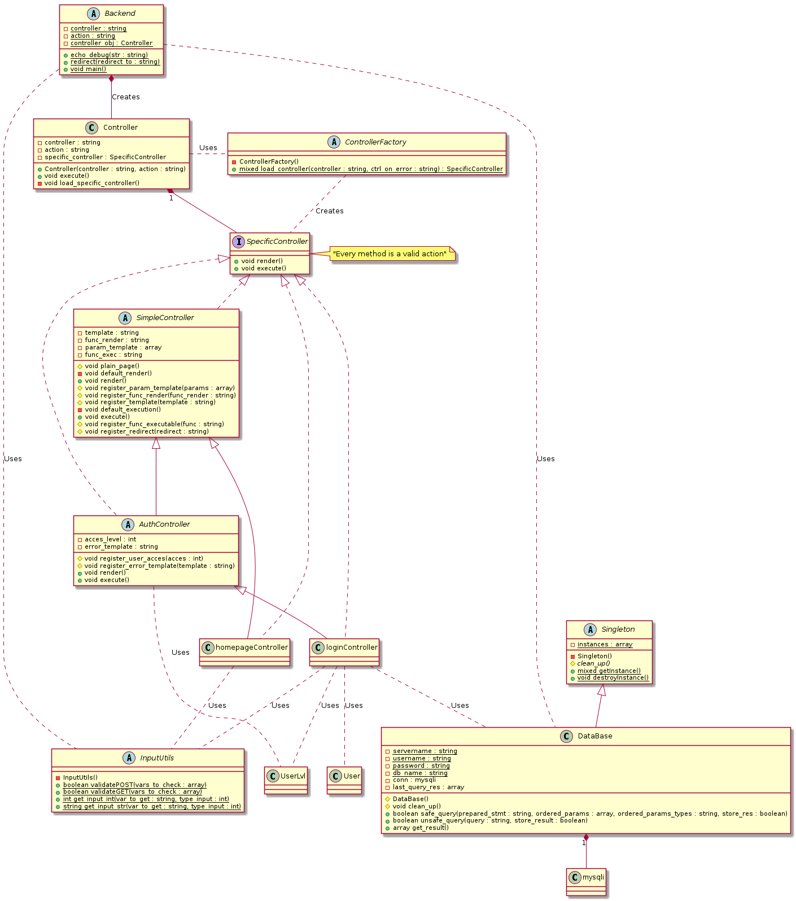

Durante el tercer año de universidad empezé a hacer bastantes páginas webs y tuve la oportunidad de experimentar cómo hacer la misma cosa de varias maneras. Al finalizar el año acabé con una pequeña plantilla para crear el *backend* de manera rápida y fácil. Existen alternativas mucho más fiables y fáciles de usar con una comunidad y buena documentación, pero da un poco de orgullo usar algo que tu mismo has creado.

# Requerimientos

Para este proyecto, como elementos externos, utilizo el motor de plantillas `twig`. Se puede encontrar más información sobre éste en https://twig.symfony.com . Para su instalación se puede usar `composer` con el siguiente comando desde el directorio del proyecto:

```bash
$ composer require "twig/twig:^3.0"
```

 # Diseño

Utiliza el patrón arquitectónico MVC (*Models Views Controller*) separando así las vistas del sistema de la lógica de éste.

## Controladores

Dentro de los controladores, uno por página en la web, encontramos dos tipologías:

- En las páginas sin autentificación, el controlador hereda de la clase abstracta *SimpleController*. El ejemplo más sencillo de esta tipología de controladores sería algo así:

  ```php
  class defaultController extends SimpleController implements SpecificController
  {
      public function __construct()
      {
          $this->plain_page();						// No queremos que acepte otros
          											// métodos a parte del GET
          $this->register_template('default.html');	// Registramos la vista que
          											// queremos que renderice
      }
  }
  ```

- Para las páginas que cuentan con autentificación cuento con la clase abstracta *AuthController* que nos permite definir el nivel de acceso que le damos a la página. El ejemplo más sencillo se vería así:

  ```php
  class restrictedController extends AuthController implements SpecificController
  {
      public function __construct()
      {
          $this->register_template('restricted.html');	// Registramos la vista
          $this->register_user_acces(UserLvl::EVERYONE);	// Registramos el nivel de
          												// Acceso a la página
      }
  }
  ```

La clase *AuthController* hereda de *SimpleController*, haciendo que muchas de las operaciones que permite también sean iguales independientemente del tipo de controlador. Como por ejemplo, el paso de parámetros a las plantillas. En ambos casos se hace mediante el método:

```php
protected function register_param_template(array $params)
{
    foreach ($params as $key => $value) {
        $this->param_template[$key] = $value;
    }
}
```

Dado que una web con múltiples páginas puede a llegar a tener una gran cantidad de controladores he optado por usar el patrón *Factory Method* a la hora de crearlos. La estrategia para la creación dinámica de los controladores se basa en los nombres de los ficheros de los controladores. Es decir, el parámetro GET `c` de cada petición determinara el fichero a cargar. Esto es peligroso ya que puede llevar a un supuesto atacante a cargar otros ficheros del sistema operativo. Para mitigar estos posibles ataques se utiliza de la siguiente manera:

```php
public static function load_controller(string $controller, string $ctrl_on_error) : SpecificController
{

    $path = 'controllers/';

    if (file_exists($path . $controller . '_ctrl.php'))
    {
        require_once($path . $controller . '_ctrl.php');
    }
    else
    {
        $controller = $ctrl_on_error;
        require_once($path . $controller . '_ctrl.php');
    }

    $controller = str_replace('-', '_', $controller);
    $controller = $controller . 'controller';
    return new $controller();
}
```

 De esta manera el atacante no puede pedir cualquier fichero en el sistema, sino que antes tendría que encontrar otro vector de ataque que le permitiera subir un archivo con el nombre específico y los métodos oportunos para evitar saltar errores.

## Modelos

Existen varios modelos para distintas funciones. Tenemos el modelo *Backend* que esta pensado para ser el modelo de la aplicación, este será el que pondermos en el fichero `index.php` para que todo empiece a funcionar tal que:

```php
// Fichero: index.php
<?php

chdir('..');
require_once 'config.php';
require_once P_MODELS . 'backend.php';

Backend::main();
```

También hay el modelo *User*, encargado de gestionar toda la información del cliente visitando el sito y  el modelo de acceso a la base de datos *DataBase*, encargado de centralizar las *queries* a la base de datos. Ambos son *singletons*. Para ello heredan de la clase *Singleton* para heredar las propiedades del patrón. Solo necesitan asegurarse que su constructor no es público y la clase *Singleton* ya se encarga de lo demás mediante un *array* estático para tener en cuenta que se ha creado y que no:

```php
final public static function getInstance()
{
    $class_to_create = get_called_class();				// Coge el nombre de la clase
    													// hijo que lo ha llamado

    if (!isset(self::$instances[$class_to_create])) {	// Comprueba si no esta creado
        self::$instances[$class_to_create] = new $class_to_create();	// Lo crea
    }

    return self::$instances[$class_to_create]; 			// O devuelve la entrada del
    													// array estático
}
```

También existen los modelos de los tipos de controladores comentados anteriormente: *SimpleController* y *AuthController*. Así como también hay un modelo de un controlador general y tanto el *Simple* como el *Auth* se relacionan con este con composición.

## Vistas

Para las vistas no hay nada en especial, simplemente uso el motor de plantilla `twig` como se ha comentado antes. Se registran en los controladores y se les da parámetros para que estén listas.


Añado un diagrama de clases que aportará más claridad que mi explicación.



# Conclusiones

Fue un proyecto divertido que he usado y re-usado muchas veces para tener un punto de partida a la hora de crear páginas en PHP, pero el hecho de como se cargan los controladores específicos aún pienso que se puede mejorar para acabar de mitigar completamente el riesgo.
